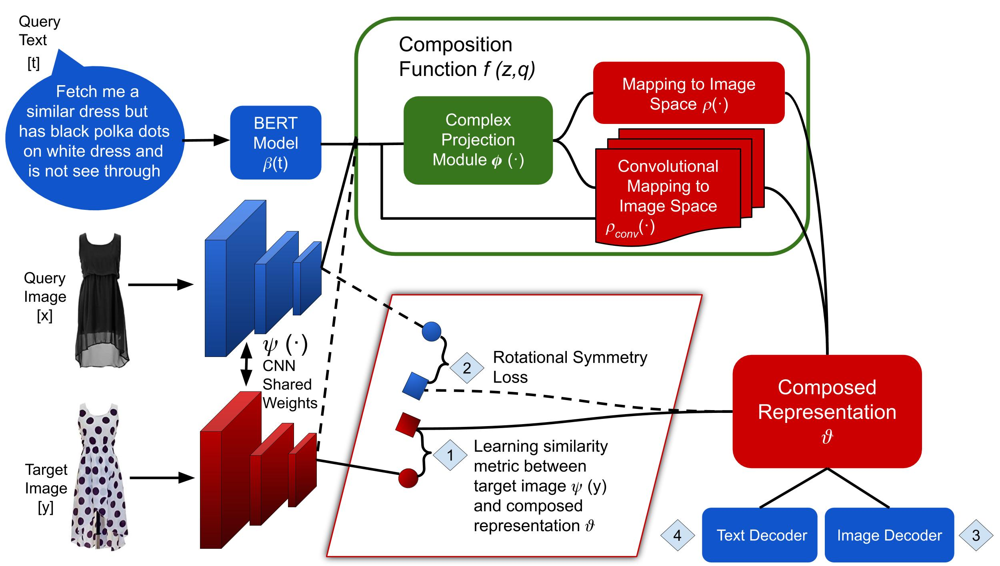

[](https://paperswithcode.com/sota/image-retrieval-with-multi-modal-query-on-mit?p=compositional-learning-of-image-text-query)

[](https://paperswithcode.com/sota/image-retrieval-with-multi-modal-query-on?p=compositional-learning-of-image-text-query)

# Compositional Learning of Image-Text Query for Image Retrieval : WACV 2021
The paper can be accessed at: https://arxiv.org/pdf/2006.11149.pdf. This is the code accompanying the WACV 2021 paper: Compositional Learning of Image-Text Query for Image Retrieval.

## Introduction

One of the peculiar features of human perception is multi-modality. We unconsciously attach attributes to objects, which can sometimes uniquely identify them. 
For instance, when a person says apple, it is quite natural that an image of an apple, which may be green or red in color, forms in their mind. 
In information retrieval, the user seeks information from a retrieval system by sending a query. Traditional information retrieval systems allow a unimodal query, i.e., either a text or an image.

## Teaser Figure 


Advanced information retrieval systems should enable the users in expressing the concept in their mind by allowing a multi-modal query.

In this work, we consider such an advanced retrieval system, where users can retrieve images from a database based on a multi-modal (image-text) query. 
Specifically, the query text prompts some modification in the query image and the task is to retrieve images with the desired modifications. This task has applications in the domain of E-Commerce search, surveillance systems and internet search.

The figure shows a potential application scenario of this task.
In this figure a user of an E-Commerce platform is interested in buying a dress, which should look similar to her friend’s dress, but the dress should be of white color with a ribbon sash. In this case, we would like the algorithm to retrieve some dresses with desired modifications in the query dress. 

## ComposeAE Architecture 
We propose an autoencoder based model, ComposeAE, to learn the composition of image and text query
for retrieving images. We adopt a deep metric learning approach and learn a metric that pushes composition
of source image and text query closer to the target images. We also propose a rotational symmetry constraint
on the optimization problem. 


## Requirements and Installation
* Python 3.6
* [PyTorch](http://pytorch.org/) 1.2.0
* [NumPy](http://www.numpy.org/) (1.16.4)
* [TensorBoard](https://github.com/TeamHG-Memex/tensorboard_logger)
* Other packages can be found in [requirements.txt](https://github.com/ecom-research/ComposeAE/blob/master/requirements.txt)


## Running the experiments 

### Download the datasets
#### MITStates dataset

Download the dataset via this [link](http://web.mit.edu/phillipi/Public/states_and_transformations/index.html) and save it in the ``data`` folder. Kindly take care that the dataset should have these files:

```data/mitstates/images/<adj noun>/*.jpg```

## Running the Code

For training and testing new models, pass the appropriate arguments. 

For instance, for training original TIRG model on MITStates dataset run the following command:

```
python -W ignore  main.py --dataset=mitstates --dataset_path=../data/mitstates/  --model=tirg --loss=soft_triplet --learning_rate_decay_frequency=50000 --num_iters=160000 --weight_decay=5e-5 --comment=mitstates_tirg_original --log_dir ../logs/mitstates/
```

For training ComposeAE model on Fashion200k dataset run the following command:

```
python -W ignore  main.py --dataset=mitstates --dataset_path=../data/mitstates/  --model=composeAE --loss=batch_based_classification --learning_rate_decay_frequency=50000 --num_iters=160000 --use_bert True --use_complete_text_query True --weight_decay=5e-5 --comment=mitstates_composeAE --log_dir ../logs/mitstates/
```

* use_bert should always be true for ComposeAE
* Checkpoints will be saved in the log files
* To evaluate the model from the latest checkpoint, give the checkpoint path and set --test_only to True

## Running with Colab

Download the MITstates dataset and place it in /data/mitstates and run the colab notebook. All the individual files are transformed into colab cells. In the last cell(main file), all the parameters are defaulted to run composeAE with optimal parameters.

### Citation
If you find this code useful in your research then please cite
```
@InProceedings{Anwaar_2021_WACV,
    author    = {Anwaar, Muhammad Umer and Labintcev, Egor and Kleinsteuber, Martin},
    title     = {Compositional Learning of Image-Text Query for Image Retrieval},
    booktitle = {Proceedings of the IEEE/CVF Winter Conference on Applications of Computer Vision (WACV)},
    month     = {January},
    year      = {2021},
    pages     = {1140-1149}
}
```


